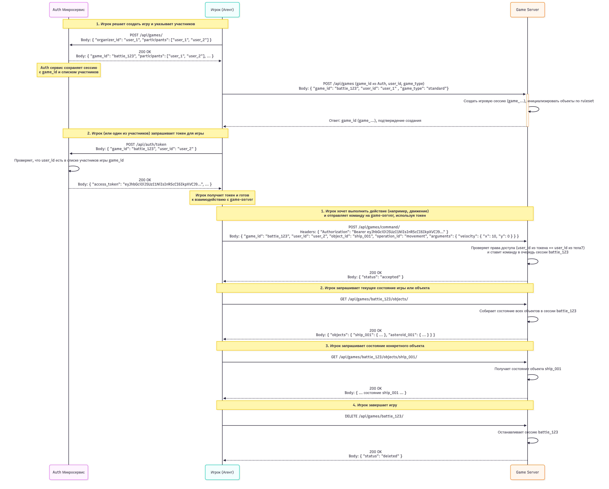

# Игра "Космическая битва"

В далекой звездной системе встретились несколько флотилий космических кораблей. Корабли могут передвигаться по всему пространству звездной системы по прямой, поворачиваться против и по часовой стрелке, стрелять из различного вида вооружения и совершать иные действия. Попадание фотонной торпеды в корабль наносит ему повреждения.
От каждой флотилии в сражении принимают участие по несколько космических корабля.
Победу в битве одерживает та флотилия, которая первой выведет из строя все корабли соперника.

# Установка

- **Генерация криптографических ключей**
    
    Перед запуском сервисов необходимо сгенерировать пару RSA-ключей (приватный и публичный), необходимые для аутентификации JWT-токенов между сервисами

    ```bash
    scripts/init-secrets.sh
    ```
- **Запуск микросервисов с помощью Docker Compose**
    ```bash
    docker-compose up --build
    ```
## Техническое описание задания:

Целью проекта являлась разработка архитектурно устойчивой системы для сетевых сражений между космическими кораблями, демонстрирующей применение ключевых принципов (SOLID) и паттернов проектирования в контексте микросервисной архитектуры.


# Диаграмма взаимодействия сервисов:
 

Диаграмма sequenceDiagram participant.txt иллюстрирует ключевые этапы взаимодействия между Игроком (P), Auth-сервисом (A) и Game Server (G): 

- Создание игры: Игрок инициирует создание новой игровой сессии, отправляя `POST /api/games/` на сервис Auth, указывая организатора и список участников. Сервис Auth создает запись о сессии и возвращает уникальный `game_id`.
- Инициализация сессии на Game Server: Игрок использует полученный `game_id`, чтобы отправить `POST /api/games` на Game Server. Game Server создает внутреннюю игровую сессию с переданным `game_id`, инициализирует игровые объекты в соответствии с `game_type` (правилами `ruleset`) и подтверждает создание.
- Получение токена: Игрок или любой другой участник, который хочет взаимодействовать с созданной сессией, обращается к сервису Auth с `POST /api/auth/token`, передавая `game_id` и `user_id`. Сервис Auth проверяет, состоит ли `user_id` в списке участников, ассоциированных с `game_id`. Если проверка успешна, Сервис Auth генерирует и возвращает JWT-токен, подписанный приватным ключом (хранящимся в примонтированном `/keys/private.pem`  через `volume` в `docker-compose`).
- Взаимодействие с Game Server с аутентификацией: Игрок использует полученный токен для аутентификации при последующих запросах к Game Server (например, `POST /api/games/command`), передавая его в заголовке Authorization: Bearer <токен>.
     



Эта диаграмма демонстрирует слабую связь между сервисами. Game Server не обязан напрямую запрашивать информацию из сервиса Auth на каждом шаге взаимодействия игрока. Вместо этого Game Server полагается на валидацию JWT-токена, который был выдан сервисом Auth. Game Server получает публичный ключ (из примонтированного `/keys/public.pem` через `volume` в `docker-compose`), необходимый для проверки подписи токена. Это разделяет ответственность сервисов (сервис Auth отвечает за выдачу токенов, Game Server отвечает за их проверку и игровую логику) и упрощает масштабирование и обеспечивает безопасное взаимодействие.

# Примененные паттерны: 

- **Команда** (**Command**): Игровая логика (движение, стрельба, поворот, потребление топлива) инкапсулирована в объекты команд. Это позволяет легко добавлять, комбинировать (MacroCommand) и тестировать логику.
- **Фабрика** (**Factory**): Используются фабрики команд (IObjectCommandFactory) для создания объектов на основе конфигурации.
- **Адаптер** (**Adapter**): Паттерн используется для адаптации универсальных объектов UObject к специфичным интерфейсам (IMovableObject, IDamageableObject, IFuelConsumerObject и т.д.), обеспечивая гибкость и слабую связанность.
- **Инверсия управления** (**IoC**) / **Внедрение зависимостей** (**DI**): Центральный IoC-контейнер управляет созданием и внедрением зависимостей, что упрощает тестирование, настройку и расширение системы.
- **Стратегия** (**Strategy**): Используется для определения различных стратегий разрешения зависимостей в IoC (IDependencyResolver) и для определения различных наборов правил игры (IRuleset).
- **Цепочка обязанностей** (**Chain of Responsibility**): Реализована через систему IMiddleware для обработки входящих HTTP-запросов (например, для аутентификации).
- **Репозиторий** (**Repository**): В системе реализован паттерн Репозиторий (IGameSessionRepository, IAuthGameSessionRepository), предоставляющий абстракцию для доступа к данным сессий. Используется интерфейс, который позволяет легко заменить реализацию (к примеру, InMemoryGameSessionRepository) на другую (К примеру, для работы с PostgreSQL) через механизм DI.

## Проблемы и узкие места:

1. **Проблема: Рост сложности при изменении функционала и интеграции новых требований**
   - **Описание**: По мере добавления новых игровых механик, правил турниров, новых систем, изменение или добавление логики может затрагивать множество классов, замедляя разработку и увеличивая риск появления багов. Это соответствует проблеме "нелинейного замедления скорости разработки".
   - **Решение**: В проекте активно применяются принципы SOLID и паттерны проектирования:
     - **Паттерн Адаптер (Adapter)** : Используется для адаптации UObject к различным интерфейсам, что позволяет работать с разными типами объектов, не изменяя код команд.
     - **Паттерн Команда (Command)**: Вся игровая логика инкапсулирована в объекты команд и спроектирована так, что их можно расширять (например, добавлять новые команды на основе интерфейса `BaseCommand`, новые наборы правил с помощью `IRuleset`), не изменяя существующий код ядра программы.
     - **Паттерн Репозиторий (Repository)**: Взаимодействие с данными (например, игровыми сессиями) происходит через интерфейсы (`IAuthGameSessionRepository`). Это позволяет легко заменить реализацию (например, InMemory на PostgreSQL) без изменения бизнес-логики.

2. **Проблема: Сложность масштабирования и синхронизации в распределенной системе**
    - **Описание**: Использование микросервисов (Auth и Game Server) вводит сложности, связанные с сетевыми задержками, синхронизацией состояния, отказоустойчивостью и управлением зависимостями между сервисами
    - **Решение**:
      - **Микросервисная архитектура**: Система разделена на логически независимые компоненты. Это позволяет разрабатывать, развертываться и масштабировать сервисы независимо.
      - **Использование Docker**: Каждый микросервис упакован в Docker-контейнер, управляемые `docker-compose`, что упрощает развертывание и изоляцию.
      - **Взаимодействие через API**: Сервисы взаимодействуют через REST API, что позволяет им быть слабо связанными.
      - **Масштабирование**: Для масштабирования Game Server при большом количестве одновременных игр может потребоваться шардирование по gameId, использование кэшей (например, Redis) для состояний игр, и обработка событий через брокеры сообщений (к примеру, Kafka). Для систем уведомлений и рейтинга — асинхронная и пакетная обработка, кэширование.

3. **Проблема: Потеря данных игровых сессий**
    - **Описание**:
      - В текущей реализации проекта игровая логика и данные игровых сессий (к примеру, состояние объектов, очереди команд и т.д.) хранятся исключительно в оперативной памяти (in-memory) сервера, на котором запущен Game Server. Это связано с использованием In-Memory репозиториев.
      - Такой подход приводит к критической проблеме надежности: в случае любого перезапуска, сбоя питания или аварийной остановки процесса Game Server вся информация о текущих игровых сессиях теряется безвозвратно. Игроки, участвовавшие в сражениях, теряют прогресс, и сессии становятся недоступными.
    - **Решение**: Проект спроектирован с использованием паттерна Репозиторий (`IGameSessionRepository`), принципов DIP и использовании IoC. Это архитектурное решение позволяет изолировать бизнес-логику от конкретной реализации хранения данных и легко внедрить такую альтернативную реализацию (например, на PostgreSQL) без значительных изменений в бизнес-логике.