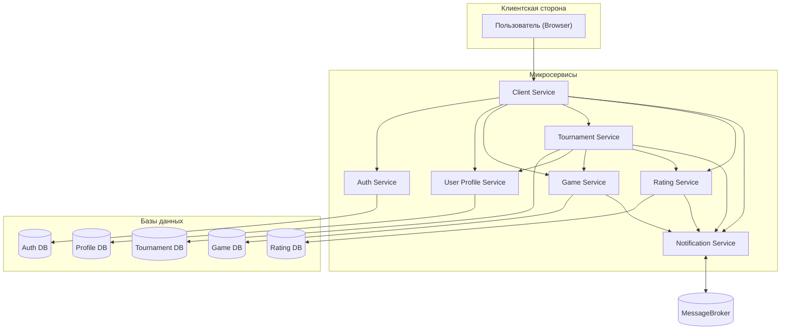
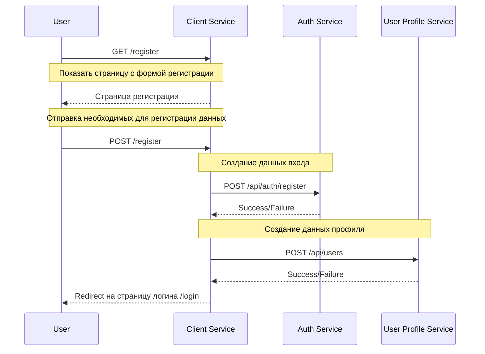
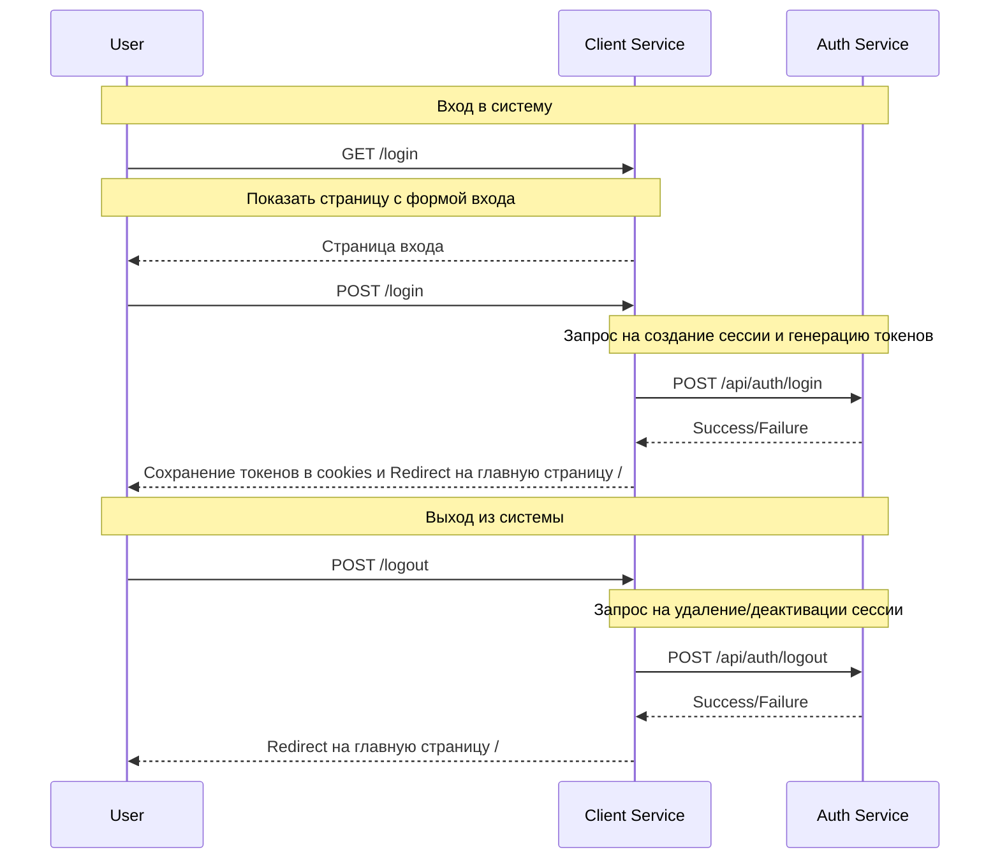
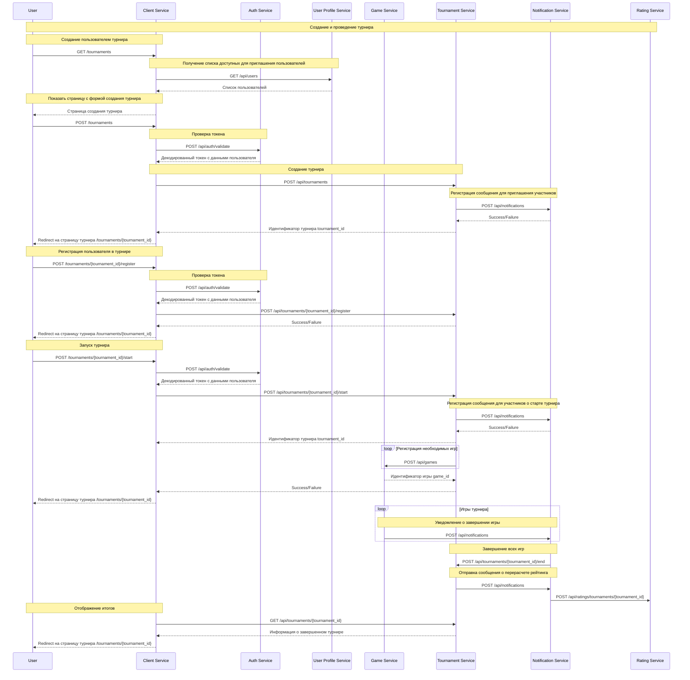

# Микросервисная архитектура для игры Космическая битва

## Оглавление
1. [Введение](#введение)
2. [Стек технологий](#стек-технологий)
3. [Микросервисы](#микросервисы)
4. [Взаимодействие между микросервисами](#взаимодействие-между-микросервисами)
5. [Потенциальные проблемы](#потенциальные-проблемы)


## Введение
Проект игры Космическая битва спроектирован с учетом следующих принципов микросервисов:
- Определены ограниченные контексты (DDD) и выделены в отдельные микросервисы;
- Каждый микросервис независим и имеет собственную БД относительно своих сущностей;
- Доступ пользователя ко API внутренних микросервисов ограничен и осуществляется через клиентский микросервис.


## Стек технологий
Описание используемых технологий в проекте.

### Backend
- Python 3.12
- FastApi
- PyJWT (RSA256)

### База данных
- PostgreSQL

### Брокер сообщений
- Redis

### Инфраструктура
- Docker + Compose
- GitHub Actions

### Тестирование
- pytest + pytest-cov
- TestClient (FastApi)

## Микросервисы

Список микросервисов с описанием.

Общая диаграмма


### Client Service (Сервис агрегации запросов)

Описание:
- Служит точкой входа для пользователя;
- Агрегирует запросы пользователя от пользователя;
- Скрывает внутреннюю архитектуру проекта от пользователя.

API Endpoints:
- `GET /` - Получить главную страницу, страница отличается для гостей и для авторизированных пользователей;
- `GET /register` - Получить страницу регистрации пользователя;
- `POST /register` - Регистрация пользователя;
- `GET /login` - Получить страницу с формой входа пользователя;
- `POST /login` - Вход в систему;
- `POST /logout` - Выход из системы;
- `GET /profile` - Получить страницу профиля;
- `GET /games` - Получить страницу со списком игр;
- `GET /games/{game_id}` - Получить страницу определенной игры;
- `POST /games/{game_id}/command` - Отправить команду на выполнение в игру (доступно только для участников);
- `GET /tournaments` - Получить страницу со списком турниров;
- `GET /tournaments/{tournament_id}` - Получить страницу определенного турнира;
- `POST /tournaments/{id}/register` - Регистрация в турнире;
- `GET /tournaments/create` - Получить страницу с формой создания турнира;
- `POST /tournaments` - Создать турнир;
- `GET /leaderboard` - Получить страницу с рейтингами;

### Auth Service (Сервис авторизации)

Описание:
- Регистрация новых пользователей;
- Хранение данных для аутентификации (логин, пароль, почта, другое).
- Хранение данных для авторизации (глобальная роль).
- Аутентификация пользователя по его данным (к примеру, логину и паролю);
- Авторизация пользователя с определением глобальной роли;
- Создание и хранение сессии для возможности входа с разных устройств;
- Генерация токенов (долгоживущего и короткоживущего токенов).

API Endpoints:
- `POST /api/auth/register` - Регистрация нового пользователя;
- `POST /api/auth/login` - Вход пользователя в систему (Аутентификация пользователя, определение роли, создание сессии, 
выдача токенов);
- `POST /api/auth/logout` - Выход пользователя из системы (Удаление или деактивация сессии);
- `POST /api/auth/refresh` - Обновление токена (выдача нового короткоживущего токена доступа через долгоживущий токен);
- `POST /api/auth/validate` - Проверка токена (декодирование токена, проверка сессии, возврат допустимых данных).

### User Profile Service (Сервис управления пользователями)

Описание:
- Создание профиля пользователя;
- Хранение и управление профилем пользователя;
- Управление настройками пользователя.

API Endpoints:
- `POST /api/users` - Регистрация нового профиля пользователя;
- `GET /api/users` - Получение информации о доступных пользователях;
- `GET /api/users/{user_id}` - Получение информации о пользователе;
- `PATCH /api/users/{user_id}` - Обновление данных профиля пользователя;
- `DELETE /api/users/{user_id}` - Удаление или деактивация профиля пользователя.

### Game Service (Сервис с игровой логикой)

Описание:
- Создание игровых сессий;
- Хранение и управление игровой сессий и связанными данными;
- Интерпретация и выполнение команд авторизованных игроков;


API Endpoints:
- `POST /api/games` - Создание новой игровой сессии;
- `GET /api/games` - Получение информации о доступных игровых сессиях;
- `GET /api/games/{game_id}` - Получение информации об определенной игровой сессии;
- `POST /api/games/{game_id}/start` - Запуск игровой сессии;
- `POST /api/games/{game_id}/command` - Запрос на выполнение команды в игровой сессии;
- `POST /api/games/{game_id}/end` - Завершение игровой сессии.

### Tournament Service (Сервис турниров)

Описание:
- Создание турниров;
- Управление и хранение данных о турнирах;
- Присоединение участников к турниру;
- Генерация турнирной сетки на основании числа участников.

API Endpoints:
- `POST /api/tournaments` - Создание нового турнира, назначение ограничений турнира;
- `GET /api/tournaments` - Получение информации о доступных турнирах;
- `GET /api/tournaments/{tournament_id}` - Получение информации об определенном турнире;
- `POST /api/tournaments/{tournament_id}/register` - Присоединение пользователю к турниру;
- `GET /api/tournaments/{tournament_id}/participants` - Получение информации об участниках;
- `GET /api/tournaments/{tournament_id}/matches` - Получение информации о матчах;
- `POST /api/tournaments/{tournament_id}/start` - Завершение регистрации пользователей в турнире, 
генерация турнирной сетки;
- `POST /api/tournaments/{tournament_id}/end` - Завершение турнира.

### Notification Service (Сервис уведомлений)

Описание:
- Регистрация событий от разных сервисов;
- Отправка пользователям связанных уведомлений;
- Работа с брокером сообщений;

API Endpoints:
- `POST /api/notifications` - Создание нового сообщения;
- `GET /api/notifications/{user_id}` - Получить связанные с пользователем сообщения;
- `PATCH /api/notifications/{notification_id}` - Изменение данных сообщения (прочтение пользователем). 

### Rating Service (Сервис рейтингов)

Описание:
- Расчет очков рейтинга;
- Управление и хранение рейтинга пользователей;
- Управление и хранение рейтинга турниров;

API Endpoints:
- `GET /api/ratings/users/` - Таблица лидеров игроков;
- `GET /api/ratings/users/{user_id}` - История сражений игрока;
- `GET /api/ratings/tournaments/` - Таблица лидеров турниров;
- `GET /api/ratings/tournaments/{tournament_id}` - История результатов турниров;
- `POST /api/ratings/tournaments/{tournament_id}` - Добавление результата турнира и перерасчет рейтинга;

## Взаимодействие между микросервисами

Диаграмма создания нового пользователя:



Диаграмма входа пользователя в систему и выхода:




Создание и проведение турнира


## Потенциальные проблемы
Описание потенциальных проблем для описанного архитектурного решения и возможные их решений.
### Узкие места и проблемы масштабирования

#### 1. Клиентский сервис (Client Service) как агрегат запросов 

Проблема:
- Клиентский сервис (Client Service) агрегирует все запросы от пользователей, из-за чего является критичным компонентом. 
При увеличении числа запросов и высокой нагрузке сервис может стать узким местом и точкой отказа всей системы.

Решение:
- Создать несколько экземпляров клиентского сервиса (Client Service), к примеру, с использованием gunicorn.
- Использовать балансировщик нагрузки, к примеру, nginx.
- Создание фронтенд-миркосервиса, который будет напрямую работать с внутренними API,
но это потребует проработки безопасности и более сложной агрегации на стороне клиента.

#### 2.  Нагрузка на сервис уведомлений (Notification Service)

Проблема:
- Сервис уведомлений (Notification Service) в контексте брокера сообщений предполагает 
получение большого количества сообщений, к примеру при создании большого турнира,
что может создать значительную нагрузку на сервис.

Решение:
- Создать несколько экземпляров (workers) обработчика сообщений;
- Использовать *Очередь сообщений* или для приоритизации важных сообщений использовать *Очередь с приоритетом*;
- Ограничить максимальное число возможных сообщений в очереди;
- Использование внешних сервисов. К примеру, рассылка через почтовые сервисы.

### Компоненты с изменяемыми требованиями

#### 1. Сервис с игровой логикой (Game Service)

Описание:

Данный сервис как компонент отвечает за основную логику игрового процесса.
С точки зрения развития игры, получения ей обновлений и просто настройки различных игровых режимов
данный компонент будет постоянно получать изменения,
связанные с балансом, игровыми механиками и новыми режимами.

- Частота изменения: Высокая.
- Виды изменений:
  - Баланс: Изменение характеристик игровых объектов: кораблей, оружия, двигателей.
  - Новые механики: Добавление новых типов кораблей или космических объектов, новых устройств корабля.
  - Новые игровые режимы: новые условия победы, новые игровые события.

Решение (с использованием OCP - Принцип открытости/закрытости):
- Паттерн Стратегия: Для часто изменяемых функциональных единиц игровой логики (например, расчет урона) 
определить абстракцию в виде неизменяемого или стабильного интерфейса.
Игровой сервис будет работать с конкретной реализацией данного интерфейса, заменяя по необходимости нужную реализацию.
Это позволяет расширять функциональность новыми реализациями без изменения существующего кода.
- DSL (domain-specific language): 
Реализовать настройку игровых режимов с помощью загружаемых внешних конфигурационных файлов правил игровой логики 
за счет использования предметно-ориентированного языка.
Это позволяет добавлять новые игровые режимы без изменения существующего кода.
К примеру, вариант конфигурационного файла с DSL на естественном языке:
```text
Игра содержит Космический_корабль

Космический_корабль может Двигаться_по_прямой, Вращаться, Стрелять

Двигаться_по_прямой включает MoveCommand
Вращаться включает RotateCommand
Стрелять включает ShootCommand

Игра может определять Определять_коллизию
Определять_коллизию включает CheckCollision
```
